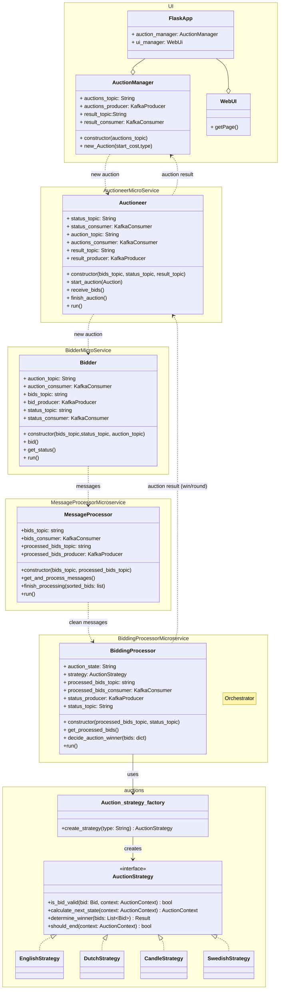

```mermaid
classDiagram

namespace UI{
class AuctionManager{

    + auctions_topic: String
    
    + auctions_producer: KafkaProducer

    + result_topic:String
    + result_consumer: KafkaConsumer

    + constructor(auctions_topic)
    
    + new_Auction(start_cost,type)

}


class FlaskApp{
    + auction_manager: AuctionManager
    + ui_manager: WebUi
}

class WebUI{
    + getPage()
}

}
FlaskApp --o WebUI
FlaskApp --o AuctionManager

namespace AuctioneerMicroService{
 class Auctioneer {
        + status_topic: String 
        + status_consumer: KafkaConsumer
        

        + auction_topic: String
        + auctions_consumer: KafkaConsumer
       
        + result_topic: String
        + result_producer: KafkaProducer
       

        + constructor(bids_topic, status_topic, result_topic)


        + start_auction(Auction)

        + receive_bids()

        + finish_auction()

        + run()
    }
}
  
namespace auctions {

    class Auction_strategy_factory {
        +create_strategy(type: String) AuctionStrategy
    }

    class AuctionStrategy {
        <<interface>>
        +is_bid_valid(bid: Bid, context: AuctionContext) bool
        +calculate_next_state(context: AuctionContext) AuctionContext
        +determine_winner(bids: List~Bid~) Result
        +should_end(context: AuctionContext) bool
    }

    class EnglishStrategy {

    }

    class DutchStrategy {

    }

    class CandleStrategy {

    }

    class SwedishStrategy {

    }
}

    AuctionStrategy <|.. EnglishStrategy
    AuctionStrategy <|.. DutchStrategy
    AuctionStrategy <|.. CandleStrategy
    AuctionStrategy <|.. SwedishStrategy


namespace BidderMicroService{

  
    class Bidder {
        
        + auction_topic: String
        + auction_consumer: KafkaConsumer

        + bids_topic: string
        + bid_producer: KafkaProducer

        + status_topic: string
        + status_consumer: KafkaConsumer


        + constructor(bids_topic,status_topic, auction_topic)

        + bid()

        + get_status()

        + run() 
    }


}

namespace MessageProcessorMicroservice{
    class MessageProcessor {
    
        +bids_topic: string
        +bids_consumer: KafkaConsumer

        +processed_bids_topic: string
        +processed_bids_producer: KafkaProducer

        +constructor(bids_topic, processed_bids_topic)

        +get_and_process_messages()

        +finish_processing(sorted_bids: list)

        +run()
    }
}

   

namespace BiddingProcessorMicroservice{
    note "Orchestrator"
    class BiddingProcessor {
        
        + auction_state: String
        
        + strategy: AuctionStrategy

        + processed_bids_topic: string
        
        
        + processed_bids_consumer: KafkaConsumer

        + status_producer: KafkaProducer
        + status_topic: String

        + constructor(processed_bids_topic, status_topic)
        
        + get_processed_bids()

        + decide_auction_winner(bids: dict)
        
        +run()
    }
}


    %% message flow %%
    AuctionManager ..> Auctioneer: new auction
    Auctioneer ..> Bidder: new auction 
    Bidder ..> MessageProcessor: messages
    BiddingProcessor ..> Auctioneer: auction result (win/round)
    MessageProcessor ..> BiddingProcessor: clean messages
    Auctioneer ..> AuctionManager: auction result

    %% dependencies %%
    Auction_strategy_factory --> AuctionStrategy : creates
    BiddingProcessor --> Auction_strategy_factory: uses
```

