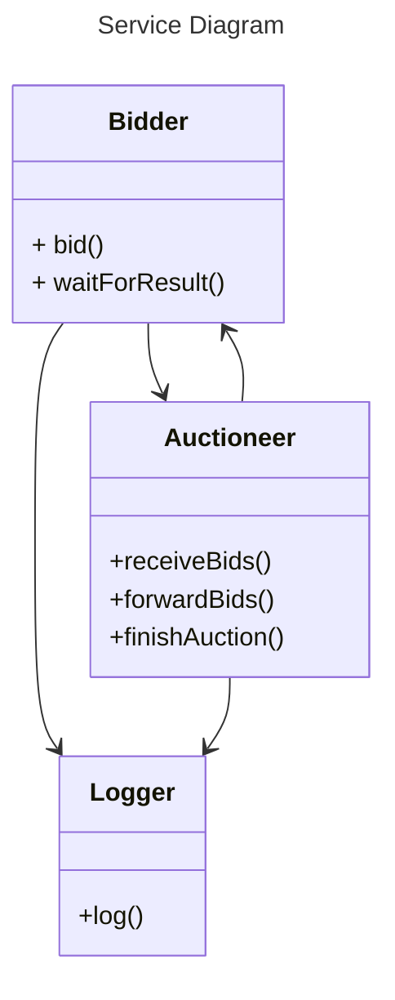

# Diagrama

```mermaid
---
title: Service Diagram
---
classDiagram
class Bidder{
    + bid()
    + waitForResult()
}

class Auctioneer{
    +receiveBids()
    +forwardBids()
    +finishAuction()
}
class Logger{
    +log()
}

Bidder -->Auctioneer

Auctioneer --> Bidder

Bidder -->Logger

Auctioneer --> Logger

```
